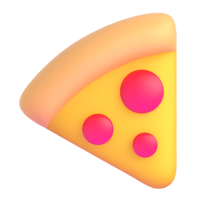

### 핏짜 – 업무에 집중하는 개발자를 위한 뉴스레터

핏짜는 바쁜 IT 직군 종사자를 위해 IT 이슈, 스타트업 등 다양한 주제를  
`매주 월요일 오전 10시`에 보내드리는 뉴스레터에요! 

현재는 2023년 09월 26일 오전 12시 기준 **488명**이 받아보고 있으셔요!

앞으로 유료화 계획은 없지만, 추후 여러가지 `비즈니스 모델`이 추가될 예정이에요.

### 아래와 같은 히스토리를 거쳐왔어요.

- 2023년 09월 21일 오후 3시 **런칭**했어요 🚀

  (런칭 과정에서 여러가지 문제가 발견되었지만, 금방 해결했어요!)

- 오후 6시 20분, 3시간 만에 구독자 **100명**을 달성했어요 ✨

  (본래 100명 구독자를 목표로 진행했어요.)

- 2023년 09월 22일 오전 11시 40분 구독자 **150명**에 달생했어요 🫶

- 그리고 오후 4시 30분, 7시 40분 기준 **200명에서 250명까지** 달성했어요.

- (중략) 2023년 09월 25일 오후 4시 **450명**까지 달성 후 현재 **488명**이에요!

- 2023년 09월 26일 오후 12시 **500명** 달성 🚀

콘텐츠를 작성하는게 즐거워서 시작했던 뉴스레터였는데,  
많은 분들께서 기대하시고, 기다려주셔서 감사해요!

더 나은 `핏짜 팀`이 되도록 할게요 

### 콘텐츠 관련 문의

콘텐츠 관련한 문의는 <a href="mailto:support@aybridge.co">이메일</a>로 부탁드릴게요!  
빠른 시간 내 답변을 약속드리며, 언제든지 편하게 문의주셔요 🙈

감사합니다.
